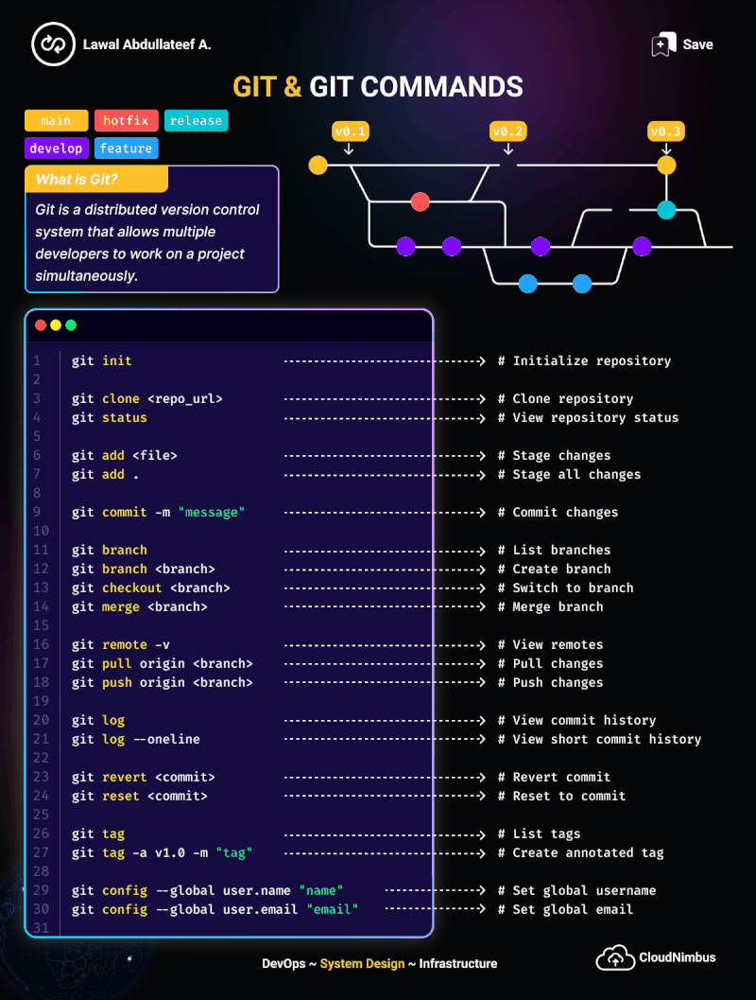

# Laboratorio de Programación II
Espacio colaborativo de los alumnos de 3er año de la Técnicatura Superior de Desarrollo de Software en Instituto Superior San Jose i27 donde cada uno trabajará en su carpeta individual y adquirirá experiencia de trabajo profesional en equipo.

## Reglas para el Alumno/a
- No modificar carpetas y archivos de otros.
- No borrar carpetas y archivos de otros.
- No subir todo el proyecto de nuevo.
- Siempre hacer git pull antes de subir cambios.
- Subir solo su carpeta.
- No usar git push --force
- Commits claros.
- Subir frecuentemente.

## Estructura del repo
```bash
laboratorio-programacion-II/
│
├── README.md
├── instrucciones.md
│
├── alumnos/
│   ├── alumno1/
│   │   ├── tp1/
│   │   ├── tp2/
│   │
│   ├── alumno2/
│   │   ├── tp1/
│   │   ├── tp2/
│
└── ejemplos/
    ├── ejemplo1.py
```
## Arquitectura básica
```bash

┌──────────────────────────────────────────────┐
│                  GitHub                      │
│        laboratorio-programacion-II           │
│                                              │
│   ┌──────────────────────────────────────┐   │
│   │  Proyecto Lógica con Python          │   │
│   │                                      │   │
│   │   ┌───────────────┐                  │   │
│   │   │   alumnos/    │                  │   │
│   │   │               │                  │   │
│   │   │ ┌───────────┐ │                  │   │
│   │   │ │ alumno1/  │ │                  │   │
│   │   │ │           │ │                  │   │
│   │   │ │  tp1.py   │ │                  │   │
│   │   │ │  tp2.py   │ │                  │   │
│   │   │ └───────────┘ │                  │   │
│   │   │               │                  │   │
│   │   │ ┌───────────┐ │                  │   │
│   │   │ │ alumno2/  │ │                  │   │
│   │   │ │  tp1.py   │ │                  │   │
│   │   │ └───────────┘ │                  │   │
│   │   └───────────────┘                  │   │
│   │                                      │   │
│   │   ┌───────────────┐                  │   │
│   │   │  ejemplos/    │                  │   │
│   │   │  (material)   │                  │   │
│   │   └───────────────┘                  │   │
│   │                                      │   │
│   │   ┌───────────────┐                  │   │
│   │   │ instrucciones │                  │   │
│   │   └───────────────┘                  │   │
│   │                                      │   │
│   └──────────────────────────────────────┘   │
└──────────────────────────────────────────────┘

```
## Pasos del Estudiante
### Primera vez
Clonar repositorio:
```bash
    git clone https://github.com/CarlosLaboratorio/laboratorio-programacion-II.git
    cd laboratorio-programacion-II
```
### Crear carpeta una sola vez
```bash
    cd alumnos
    mkdir carlos_aguirre
    cd carlos_aguirre
    mkdir tp1
```
### Trabajar normalmente
Crear archivos .py dentro de su carpeta.

### Antes de subir cambios
Muy importante
```bash
    git pull origin main
```
### Agregar cambios
```bash
    git add .
```
### Guardar cambios
```bash
    git commit -m "Agrego TP1 - Carlos Aguirre"
```
### Subir cambios
```bash
    git push -u origin main
```

## Comandos avanzados git (para Mayo)
